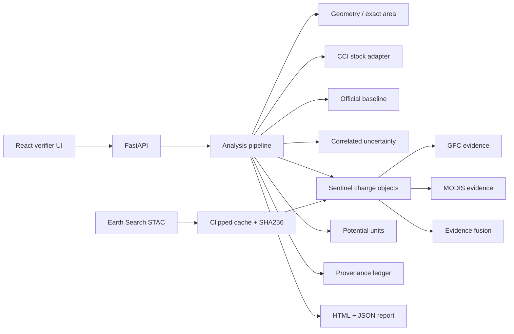

# Satellite Carbon MRV — verification-first hackathon repository

This repository implements an MRV pipeline for **satellite verification of green investment / carbon-credit scenarios**. It calculates above-ground biomass carbon stock from ESA CCI Biomass, localizes forest change with Sentinel-2, combines independent evidence from GFC/MODIS/CCI, models correlated uncertainty, applies the official baseline/credit formula, and records provenance.

It is deliberately **not** a custom-biomass neural network. CCI AGB remains the stock source; optical/fire/loss products are evidence for localization, dating and interpretation.

## 60-second judge path

```bash
python -m pip install -e '.[dev]'
# mount official dataset under data/raw/
make verify-data
make test
make research
make api         # http://localhost:8000
make frontend    # http://localhost:5173
make judge
```

Without the official dataset, unit/golden tests still run, but `verify-data`, `research` and `judge` correctly fail instead of inventing numbers.

## Carbon mathematics

For CCI pixel `i` and year `t`:

```text
c_i,t = AGB_i,t * 0.47
C_t   = Σ(exact_intersection_area_i_ha * c_i,t)
cbar  = C_t / A
ΔC    = C_t1 - C_t0
E     = -ΔC * 44/12
e     = E / (A * Δt)
```

`E > 0` means loss of carbon from the accounted live above-ground woody biomass pool; `E < 0` means accumulation. `E` is **not** claimed to be a direct atmospheric emission measurement.

Pixel/AOI overlap is measured as WGS84 geodesic area with `pyproj.Geod`; a raster pixel in EPSG:4326 is never treated as 1 ha.

## Baseline and potential units

Production Q uses the official `methodology/baseline.csv` trajectory. For each parent AOI:

```text
g       = (cbar_2019 - cbar_2015) / 4
cbase,y = max(0, cbar_2019 + g * (y - 2019))
Ebase   = -A * (cbase,t1 - cbase,t0) * 44/12
R       = Ebase - Eproj - LK       # LK=0 in the case
H       = max(Eproj - L, U - Eproj)
```

If `R <= 0`, then `Q=0`. If `H/R >= 1`, `Q=0`. Otherwise:

```text
UNC  = min(1, max(0, H/R - 0.10))
Radj = R * (1 - UNC)
B    = Radj * 0.15
Q    = floor(Radj * 0.85)
```

The official golden example is tested and yields **Q=395**.

## Uncertainty

`src/carbon_mrv/uncertainty/` implements a **scenario-based correlated Monte Carlo** model:

- per-pixel CCI SD is propagated into the stock difference;
- spatial correlation is generated as a Gaussian random field on the CCI grid;
- temporal dependence is explicit through `rho`;
- fixed seed makes runs reproducible;
- independent / moderate / strong scenarios are visible and comparable.

Outputs are called **model-based quantile intervals under stated assumptions**, not field-calibrated 95% confidence intervals. The 2019→2020 CCI change-SD can be used to diagnose implicit temporal correlation via `uncertainty/temporal.py`.

## Change evidence

Sentinel-2 annual composites use AOI-level SCL validity, not tile cloud percentage alone. Default invalid SCL classes: `0,1,2,3,8,9,10,11`; water `6` is excluded; class `7` is allowed only as lower-confidence observation. Prepared competition reflectance is **not divided by 10000 again**.

Indices:

```text
NDVI = (B8A - B04) / (B8A + B04)
NBR  = (B8A - B12) / (B8A + B12)
NDMI = (B8A - B11) / (B8A + B11)
```

Transition candidates use robust median/MAD normalization, multi-index agreement and connected objects. Evidence fusion never labels `fire` from Sentinel or GFC alone: fire requires temporally compatible MODIS burn evidence plus an optical disturbance signal.

## Dynamic open-source acquisition

`scripts/fetch_demo_data.py` queries Element 84 Earth Search `sentinel-2-l2a` by AOI/time, evaluates SCL **inside the AOI**, reads clipped COG windows, applies STAC raster scale/offset metadata, and caches arrays + item metadata + SHA-256 for offline replay.

```bash
python scripts/fetch_demo_data.py \
  --geometry path/to/aoi.geojson \
  --start 2021-06-01 --end 2021-09-30 --count 2
```

## API

```text
POST /api/v1/analysis
GET  /api/v1/analysis/{run_id}
GET  /api/v1/analysis/{run_id}/layers
GET  /api/v1/analysis/{run_id}/events
GET  /api/v1/analysis/{run_id}/provenance
GET  /api/v1/analysis/{run_id}/report
GET  /health
```

Example request:

```json
{
  "geometry": {"type":"Polygon","coordinates":[]},
  "year_start": 2020,
  "year_end": 2022,
  "data_mode": "auto",
  "parent_aoi_id": null,
  "uncertainty_scenario": "moderate"
}
```

## Architecture



## Research

`research/run_experiments.py` is data-gated. It produces quantitative CSVs only when the official dataset is mounted. It compares changed vs control AOIs, uncertainty scenarios, baseline sensitivity and three change-method variants. External GFC/MODIS agreement is described as proxy/evidence, not ground truth.

See `research/REPORT.md` and `docs/SCORECARD.md`.

## Repository map

- `src/carbon_mrv/carbon/` — stock, baseline, credits, event contribution
- `src/carbon_mrv/geometry/` — validation and exact area
- `src/carbon_mrv/data/` — CCI, prepared Sentinel, Earth Search STAC, GFC, MODIS, cache/provenance
- `src/carbon_mrv/change/` — indices, composites, transitions, connected objects, fusion
- `src/carbon_mrv/uncertainty/` — temporal diagnostics and correlated Monte Carlo
- `src/carbon_mrv/api/` — FastAPI
- `frontend/` — React/MapLibre verifier UI
- `scripts/` — dataset validation, online fetch/cache, reproducibility, preflight
- `research/` — reproducible experiments
- `docs/` — methodology, audit trail, jury material and score trace

## Non-negotiable limitations

- CCI AGB is the carbon-stock source; no satellite-to-satellite agreement is called independent ground validation.
- MODIS 500 m cells are evidence for burn timing/cause, not exact burn geometry.
- GFC indicates stand-replacement loss, not cause and not AGB amount.
- Missing/partial required coverage makes credits `unavailable`; it is never silently converted to zero.
- Scenario price calculations, if added, are scenarios, not market forecasts.
- Q is a **hackathon potential-unit output**, not a certified carbon credit.
